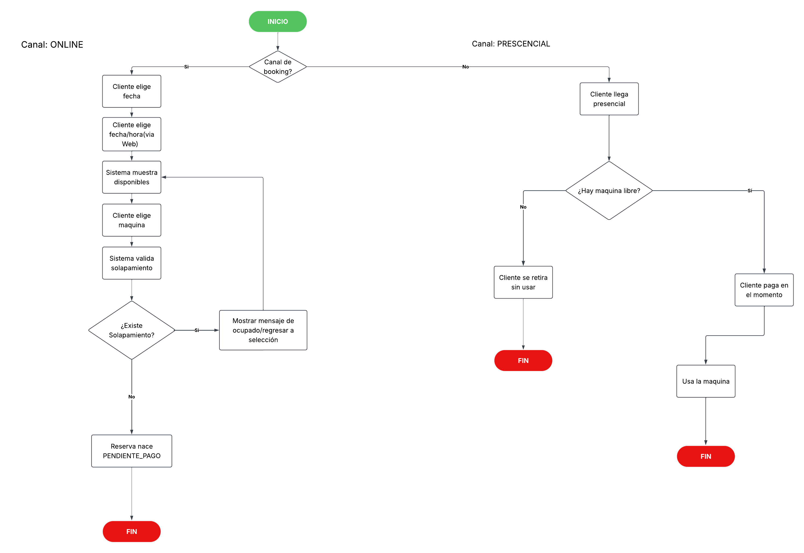
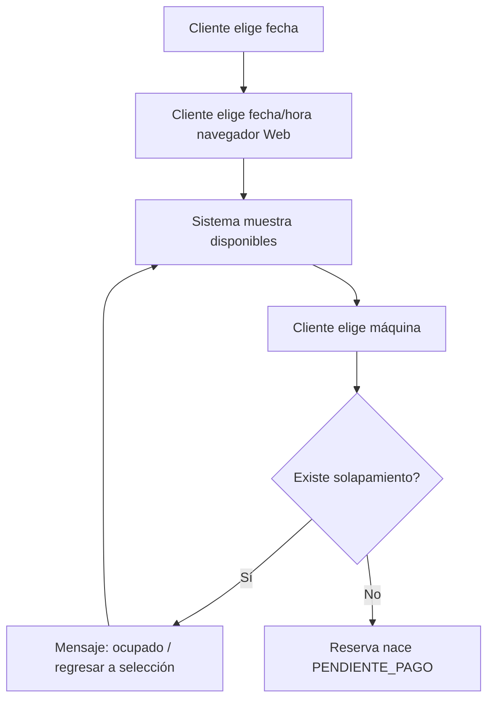
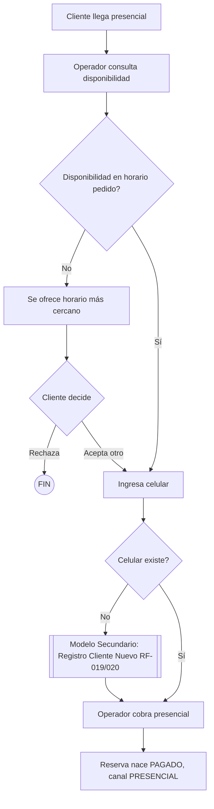

## Diagrama General (Online + Presencial)

Proyecto: LanReserve
Curso: Herramientas de Desarrollo (UTP)
Formato: Modelo Principal (Flujo Básico) + Flujo Alterno + Modelo Secundario

---

## CU-05: Reservar máquina (Canal ONLINE)

**Actor principal:** Cliente

**Precondición:** Cliente autenticado; existe al menos una máquina disponible.

### Modelo Principal (Flujo Básico)

1. El cliente elige la fecha de reserva.
2. El cliente elige fecha/hora vía navegador Web.
3. El sistema muestra las máquinas disponibles.
4. El cliente elige una máquina.
5. El sistema valida si existe solapamiento con otra reserva activa.
6. La reserva nace en estado `PENDIENTE_PAGO`.

### Flujo Alterno

**5.1 — Existe solapamiento**
En el paso 5, si la máquina ya está ocupada en ese horario:
1. El sistema muestra un mensaje de "ocupado" y regresa a la selección.
2. El flujo regresa al paso 3.

**Postcondición:** Reserva en `PENDIENTE_PAGO`, máquina bloqueada en ese horario hasta que el operador valide el pago (CU-06) o se marque no-show tras 15 min de gracia.

---

## CU-12: Registrar reserva presencial (Canal PRESENCIAL)

**Actor principal:** Operador (el cliente presencial no necesita estar autenticado)

**Precondición:** Operador autenticado en la consola de mostrador.

### Modelo Principal (Flujo Básico)

1. El cliente llega presencial y pregunta por disponibilidad.
2. El operador consulta la disponibilidad en el horario pedido.
3. El operador ingresa el celular del cliente.
4. El sistema verifica si el celular ya existe.
5. El operador cobra en el mostrador (presencial).
6. La reserva nace en estado `PAGADO`, canal `PRESENCIAL`.

### Flujo Alterno

**2.1 — No hay disponibilidad en el horario pedido**
En el paso 2, si no hay máquinas libres en ese horario:
1. El sistema/operador ofrece el horario más cercano disponible.
2. El cliente decide: acepta otro horario (regresa al paso 3) o se retira.
3. Si se retira, termina el caso de uso (FIN).

### Modelo Secundario 1 — Registro de Cliente Nuevo (RF-019 / RF-020)

Se activa desde el paso 4 cuando el celular ingresado **no existe** en el sistema. No es un simple desvío de un paso: es un sub-proceso completo con sus propios pasos.

1. El operador registra Nombre + Celular del cliente (RF-019).
2. El sistema pregunta si la contraseña es obligatoria.
3. Si no es obligatoria, se valida/crea el cliente directamente (RF-020).
4. Si se define contraseña, se valida y crea el cliente con acceso web habilitado.
5. Retorna al Modelo Principal en el paso 5 (operador cobra presencial).

**Postcondición:** Reserva `PAGADO` con `canal = PRESENCIAL`, máquina bloqueada en ese horario; si el cliente era nuevo, queda además un `USUARIO` creado para futuras visitas (RF-019/020).

